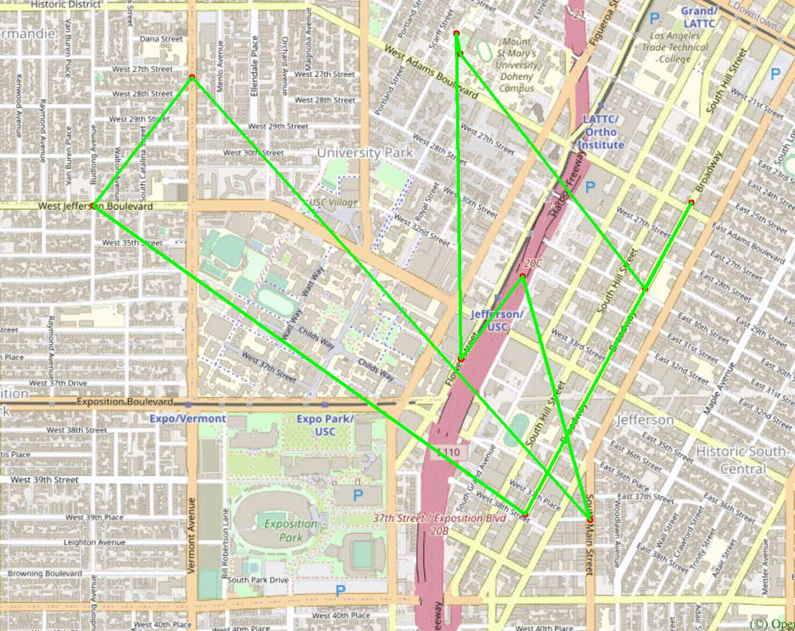

# EE 599 Final Project 

Team **CoreDump** by **Folk Narongrit** for the University of Southern California as part of the **Master of Science** program in **Electrical Engineering** 

## Program Description

### High Level Overview

This is a basic mapping program that takes coordinate information from a CSV database of each point. The data includes a position ID, latitude and longitude information, the position name, and the list of neighboring nodes. The CSV database is read upon initialization and stored in a private variable (for security purposes) and class.
A simple textual user interface allows the user to select from a number of functions and supply the input information. 
The following functions are included in the program:
		1) **Autocomplete** which takes a partial substring of a location's name and returns all possible results with the same partial substring;
		2) **Coordinates from Name** which takes the location's name and returns the coordinate point, along with a pinpoint on the map plot.
		3) **Shortest Path between two points**, where the user enters two points (from->to) and the program determines the set of coordinates representing the shortest path between the given points. The path is plotted on the map.
		4) **Traveling Salesperson** which finds the shortest path of travel connecting all points. This represents the shortest path to go through all the points without repeating any points.

### Detailed Description of Functions

```cpp
class Node();
```

is the overlying storage class of this program, which stores all the necessary location information from the imported CSV file. It contains the variables: `<string> id` (unique ID); `<double> lat,lon` (coordinates); `<string> name` (Location name); `<vector<string>> neighbors` (a vector containing IDs of neighbors)  

```cpp 
class TrojanMap();
```

is the overlying class for the program that contains all the functions necessary to run the program. The following functions form part of the `TrojanMap` class. Note that all functions within this class are `public` unless specified.

```cpp
void PrintMenu();
```

displays the user interface menu, and is the backbone of the program, interfacing the user with the program. Printing the menu has time complexity `O(1)`

```cpp
void CreateGraphFromCSVFile();
```

performs an import of the CSV file, by looping through each entry and storing it in the `Node()` class. The time complexity is in the order of `O(n)`

```cpp
double GetLat(std::string id);
```

takes the id and performs a search through the `Node()` class and returns the latitude of the corresponding ID, if found. The time complexity is `O(n)`, as all points are iterated to perform the search.

```cpp
double GetLon(std::string id);
```

takes the id and performs a search through the `Node()` class and returns the longitude of the corresponding ID, if found. The time complexity is `O(n)`, as all points are iterated to perform the search.

```cpp
double GetName(std::string id);
```

takes the id and performs a search through the `Node()` class and returns the name of the corresponding ID, if found. The time complexity is `O(n)`, as all points are iterated to perform the search.

```cpp
std::vector<std::string> GetNeighborIDs (std::string id);
```

takes the id and performs a search through the `Node()` class and returns a vector list of neighbors of the corresponding ID position, if found. The time complexity is `O(n)`, as all points are iterated to perform the search.

```cpp
double CalculateDistance(const Node &a, const Node&b);
```

takes the position class of two points `a`, `b` and calculates the Haversine (great-circle) distance between the two points. The final distance is returned in *miles*. The time complexity is in the order `O(1)`, as the same mathematical formula is used regardless of the position.

```cpp
double CalculatePathLength(std::vector<std::string> &path);
```

takes the vector of unique IDs representing the desired path, converts each ID to a position `Node` , and calculates the total Haversine distance connecting all given points. The time complexity is in the order `O(n)` as all position are converted into `Node` iteratively before being sent to the `CalculateDistance` function.

```cpp
  std::vector<std::string> Autocomplete(std::string name);
```

takes a partial substring of a location's name, converts it to lowercase (to allow case-insensitive searches), and iterates through all `Node::name`, comparing the first *i* characters to determine all matches. All locations are iterated to find all possible matches; the time complexity therefore is in the order of `O(n)` 

 ```cpp
std::vector<std::string> CalculateShortestPath(std::string location1_name,std::string location2_name);
 ```

This function calculates the shortest path given two location names, by first converting the location name into the `Node` position class, and then passing the position into the Dijkstra algorithm.

For this implementation, the shortest path is iterated through all nodes in the database. This is first done by creating an *adjacency list* using the data. The adjacency list is a map that represents the distance from one node to its neighbor nodes. The source's neighbor is pushed onto a **priority queue**, which orders the distances such that the minimum total distance path is given. 


Iteration is performed, then the shortest distance member is removed from the priority queue (`pop`) until all nodes are explored (priority queue is empty). For every iteration, the shortest distance node in the queue is removed, representing the previously added neighbors, and adds a new neighbor if that node hasn't been explored. If the node has been explored, the path from the current node the previous node is added **if** the total distance is less than the current minimum. If the distance is less than the current minimum, the value is set as the new minimum, and previous nodes are updated. Once all nodes have been explored, then the results are returned in reverse, where the node orders are pushed to a list in from beginning to end, which is then returned from the function.

Every edge of the graph is visited, represented as `E`, and every node of the graph is also visited, represented as `V`. Since we iterate the loop `E` times and pushing into the priority queue of size `V` gives the general time complexity of `O(E+V)`, with the worse case of iterating of equal nodes and edges (fully connected) will give the time complexity in the order of `O(n²)`

```cpp
std::pair<double, std::vector<std::vector<std::string>>> TravellingTrojan(std::vector<std::string> &location_ids);
std::pair<double, std::vector<std::vector<std::string>>> TravellingTrojan_2opt( std::vector<std::string> &location_ids);
```

This is an implementation of the **Traveling Salesperson** problem, called Traveling Trojan. This function takes in a vector of location IDs, and reorders them such that the path that covers all the points have minimum length. Two functions methods are used which are 1) brute force; and 2) 2-OPT heuristic

1. **Brute Force**: This function generates all possible permutations of the given locations. The path distance for each permutation is calculated. If a given permutation has a distance less than the current minimum, it is stored as the new minimum. After all iterations are performed, the function returns the list of all permutations performed, and the shortest path distance. Going through all permutations means that the time complexity is in the order of `O(n!)`
2. **2-Opt**: The two opt is a heuristic solution, which provides an approximate (local minima) for the distance, so it is bound to errors depending on the initial conditions (starting point). This algorithm Perform swaps of two to avoid routes that cross over itself. Swaps are continued until no distance is no longer improved. Namely that the distance change between the two points are under a set threshold value. This algorithm requires `O(n^2)` time complexity, as it performs each swap while iterating through the permutations. The swap is performed using the `private: void twoOptSwap` helper function

### Discussion, Conclusion, Lessons Learned

- The Dijkstra algorithm is guaranteed to achieve the shortest path because it explores all possibility, but it is a greedy algorithm which has a relatively high time complexity. Other algorithms such as A* is more efficient when the paths are relatively non-complex.
- Brute force algorithms are extremely inefficient, especially when all permutations are required to be performed. However it is guaranteed to return the correct outcome, as all permutations are exhausted before reaching a conclusion.
- Common graph search algorithms can be implemented practically
- Heuristic algorithms can be fast and more efficient when exact precision is not required, however it may not always produce the desired results – an *accuracy-efficiency* tradeoff.
- Algorithm optimization is critical in the performance of a program
- Graph search is used in a multitude of industries:  search engines, logistics, network routing, simulation, cost optimization, ranking, city planning


----
# EE599 Final Project - TrojanMap

## TrojanMap

> This project focuses on using data structures and graph search algorithms to build a mapping application.
<p align="center"></p>

- Please clone the repository, look through [README.md](README.md) and fill up functions to finish in the project.
- Please make sure that your code can run `bazel run/test`.
- In this project, you will need to fill up [trojanmap.cc](src/lib/trojanmap.cc) and add unit tests in tests.
- Do **Not** change or modify any given functions that are specified not to change in [trojanmap.cc](src/lib/trojanmap.cc) and [trojanmap.h](src/lib/trojanmap.h). Unexpected changes will result in zero credit. Only modify and complete the functions that are specified.
- For coding questions, there is a **black box** testing for each question. All points are only based on passing the tests (i.e. we don't grade your work by your source code). Try to do comprehensive testing before your final submission.
- For submission, please push your solutions to your own Github before the deadline.
- **Due Dates**:
  - **Specifying team members**: You can work on the project in teams of 1 to 2 students. Please [specify your team members](https://docs.google.com/spreadsheets/d/1lkI0viun0lW3rjniwAyFGl9e8kTKXqmRoRFzzxDueSE/edit?usp=sharing) by Wednesday November 4th.
  - **Video presentation**: Monday November 23rd (In the class). Each team should create a 1 to 2 minute presentation that includes: quick introduction of the team, explanation of the solution architecture (High level. Use slides and some graphs. No need to go into code details. Focus on one interesting part and explain that if you want). You can refer to the [sample videos from the previous semester](https://github.com/ourarash/EE599_SP2020_Final_Project).
  - **Final report: Friday**, November 27th by 6:30 pm
- Total: 120 points. 100 points is considered full credit.

---

## The data Structure

Each point on the map is represented by the class **Node** shown below and defined in [trojanmap.h](src/lib/trojanmap.h).

```cpp
class Node {
  public:
    std::string id; // A unique id assign to each point
    double lat;     // Latitude
    double lon;     // Longitude
    std::string name; // Name of the location. E.g. "Bank of America".
    std::vector<std::string> neighbors; // List of the ids of all neighbor points.
};
```

---

## Prerequisites

### OpenCV Installation

For visualizations we use OpenCV library. You will use this library as a black box and don't need to worry about the graphic details.

**Notice**: Installing this library may take a long time. This is only for visualization. You can still start coding even without installing this library and visualization.

Use the following commands to install OpenCV.

```shell
cd TrojanMap
git clone https://github.com/opencv/opencv.git
cd opencv/
mkdir build install
cd build
```

For Ubuntu,
```shell
sudo apt-get install cmake libgtk2.0-dev pkg-config
sudo apt install libcanberra-gtk-module libcanberra-gtk3-module
```

For MacOS,
```shell
brew install cmake
```

Next, type the following, but make sure that you set the **path_to_install_folder** to be the absolute path to the install folder under opencv.

```shell
cmake -D CMAKE_INSTALL_PREFIX=**path_to_install_folder** -D BUILD_LIST=core,highgui,imgcodecs,imgproc,videoio  -D WITH_TBB=ON -D WITH_OPENMP=ON -D WITH_IPP=ON -D CMAKE_BUILD_TYPE=RELEASE -D BUILD_EXAMPLES=OFF -D WITH_NVCUVID=ON -D WITH_CUDA=ON -D BUILD_DOCS=OFF -D BUILD_PERF_TESTS=OFF -D BUILD_TESTS=OFF -D WITH_CSTRIPES=ON -D WITH_OPENCL=ON ..
make install
```

For example, if cloned this repo under "/Users/ari/github/TrojanMap", you should type:

```shell
cmake -D CMAKE_INSTALL_PREFIX=/Users/ari/github/TrojanMap/opencv/install  -D BUILD_LIST=core,highgui,imgcodecs,imgproc,videoio  -D WITH_TBB=ON -D WITH_OPENMP=ON -D WITH_IPP=ON -D CMAKE_BUILD_TYPE=RELEASE -D BUILD_EXAMPLES=OFF -D WITH_NVCUVID=ON -D WITH_CUDA=ON -D BUILD_DOCS=OFF -D BUILD_PERF_TESTS=OFF -D BUILD_TESTS=OFF -D WITH_CSTRIPES=ON -D WITH_OPENCL=ON ..
make install
```

---

## Run the program

Please run:

```shell
bazel run src/main:main
```

If everything is correct, this menu will show up.

```shell
**************************************************************
* Select the function you want to execute.
* 1. Autocomplete
* 2. Find the position
* 3. CalculateShortestPath
* 4. Traveling salesman problem
* 5. Exit
**************************************************************
```

## Test the program

We create some tests for you to test your program, please run
```shell
bazel test tests:tests:trojanmap_test
```

Please add you test in the [trojanmap_test_student.cc](tests/trojanmap_test_student.cc) and run

```shell
bazel test tests:trojanmap_test_student
```

## Your task is to implement a function for each menu item

## Step 1: Autocomplete the location name

```c++
std::vector<std::string> Autocomplete(std::string name);
```

We consider the names of nodes as the locations. Implement a method to type the partial name of the location and return a list of possible locations with partial name as prefix. Please treat uppercase and lower case as the same character.

Example:

Input: "ch" \
Output: ["ChickfilA", "Chipotle Mexican Grill"]

Input: "ta" \
Output: ["Target", "Tap Two Blue"]

```shell
1
**************************************************************
* 1. Autocomplete
**************************************************************

Please input a partial location:ch
*************************Results******************************
ChickfilA
Chipotle Mexican Grill
**************************************************************
```

## Step 2: Find the place

```c++
std::pair<double, double> GetPosition(std::string name);
```

Given a location name, return the latitude and longitude. There is no duplicate location name. Mark the locations on the map. If the location does not exists, return (-1, -1).

Example:

Input: "ChickfilA" \
Output: (34.0167334, -118.2825307)

Input: "Ralphs" \
Output: (34.0317653, -118.2908339)

Input: "Target" \
Output: (34.0257016, -118.2843512)

```shell
2
**************************************************************
* 2. Find the position
**************************************************************

Please input a location:Target
*************************Results******************************
Latitude: 34.0257 Longitude: -118.284
**************************************************************
```

<p align="center"></p>

## Step 3: CalculateShortestPath

```c++
std::vector<std::string> CalculateShortestPath(std::string location1_name,
                                               std::string location2_name);
```

Given 2 locations A and B, find the best route from A to B. The distance between 2 points is the euclidean distance using latitude and longitude. You can use Dijkstra algorithm or A\* algorithm. Compare the time for the different methods. Show the routes on the map. If there is no path, please return empty vector.

Example:

Input: "Ralphs", "ChickfilA" \
Output: ["2578244375", "5559640911", "6787470571", "6808093910", "6808093913", "6808093919", "6816831441",
      "6813405269", "6816193784", "6389467806", "6816193783", "123178876", "2613117895", "122719259",
      "2613117861", "6817230316", "3642819026", "6817230310", "7811699597", "5565967545", "123318572",
      "6813405206", "6813379482", "544672028", "21306059", "6813379476", "6818390140", "63068610", 
      "6818390143", "7434941012", "4015423966", "5690152766", "6813379440", "6813379466", "21306060",
      "6813379469", "6813379427", "123005255", "6807200376", "6807200380", "6813379451", "6813379463",
      "123327639", "6813379460", "4141790922", "4015423963", "1286136447", "1286136422", "4015423962",
      "6813379494", "63068643", "6813379496", "123241977", "4015372479", "4015372477", "1732243576",
      "6813379548", "4015372476", "4015372474", "4015372468", "4015372463", "6819179749", "1732243544",
      "6813405275", "348121996", "348121864", "6813405280", "1472141024", "6813411590", "216155217", 
      "6813411589", "1837212103", "1837212101", "6820935911", "4547476733"]

```shell
3
**************************************************************
* 3. CalculateShortestPath
**************************************************************
*************************Results******************************
2578244375
5559640911
6787470571

...

6820935911
4547476733
**************************************************************
```

<p align="center"></p>

## Step 4: The Travelling Trojan Problem (AKA Traveling salesman!)

```c++
std::pair<double, std::vector<std::vector<std::string>>> TravellingTrojan(
      std::vector<std::string> &location_ids);
```

In this section, we assume that a complete graph is given to you. That means each node is a neighbor of all other nodes.
Given a vector of location ids, assume every location can reach every location in the list (Complete graph. Do not care the neighbors).
Find the shortest route that covers all the locations and goes back to the start point. You will need to return the progress to get the shortest
route which will be converted to a animation.  

We will use the following algorithms:

- Brute Force Method
```c++
std::pair<double, std::vector<std::vector<std::string>>> TravellingTrojan(
      std::vector<std::string> &location_ids);
```
- [2-opt Heuristic](https://en.wikipedia.org/wiki/2-opt). Also see [this paper](http://cs.indstate.edu/~zeeshan/aman.pdf)
```c++
std::pair<double, std::vector<std::vector<std::string>>> TravellingTrojan_2opt(
      std::vector<std::string> &location_ids);
```

Show the routes on the map. For each intermediate solution, create a new plot. Your final video presentation should include the changes to your solution.

We will randomly select N points in the map and run your program.

```shell
4
**************************************************************
* 4. Travelling salesman problem                              
**************************************************************

In this task, we will select N random points on the map and you need to find the path to travel these points and back to the start point.

Please input the number of the places:10
Calculating ...
*************************Results******************************
123120189
1931345270
4011837224
4011837229
2514542032
2514541020
6807909279
63068532
214470792
4015477529
123120189
**************************************************************
The distance of the path is:4.61742
**************************************************************
You could find your animation at src/lib/output.avi
```

<p align="center"></p>

<p align="center"></p>

## Report and Rubrics:

Your final project should be checked into Github. The README of your project is your report.

### Report:

Your README file should include two sections:

1. High-level overview of your design (Use diagrams and pictures)
2. Detailed description of each function and its time complexity.
3. Discussion, conclusion, and lessons learned.

### Rubrics:

1. Implementation of auto complete: 10 points.
2. Implementation of GetPosition: 5 points.
3. Implementation of shortest path: 20 points.
4. Implementation of Travelling Trojan: 
   1. Brute Force: 10 points
   2. 2-opt: 15 points.
   3. Animated plot: 10 points.
5. Creating reasonable unit tests: 20 points.
6. Video presentation and report: 10 points.
7. **Extra credit items**: Maximum of 20 points:
   1. A second shortest path algorithms (For example, you can implement both Bellman-Ford and Dijkstra): 10 points.
   2. [3-opt](http://cs.indstate.edu/~zeeshan/aman.pdf) (If you chose to implement 2-opt for Travelling Trojan): 20 points.
   3. [Genetic algorithm](https://www.geeksforgeeks.org/traveling-salesman-problem-using-genetic-algorithm/) implementation for Travelling Trojan: 20 points.
